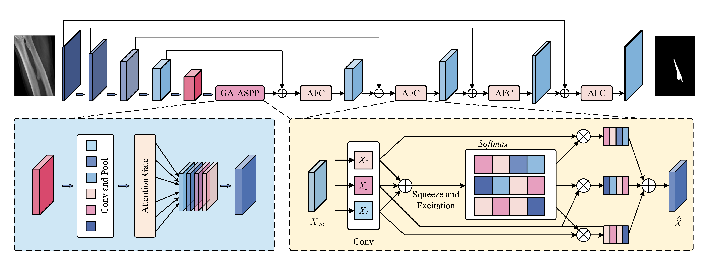
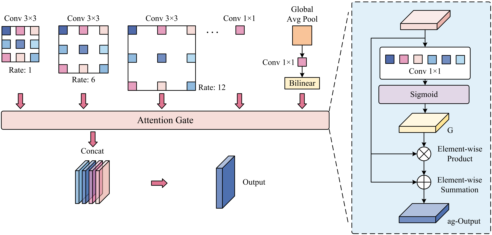
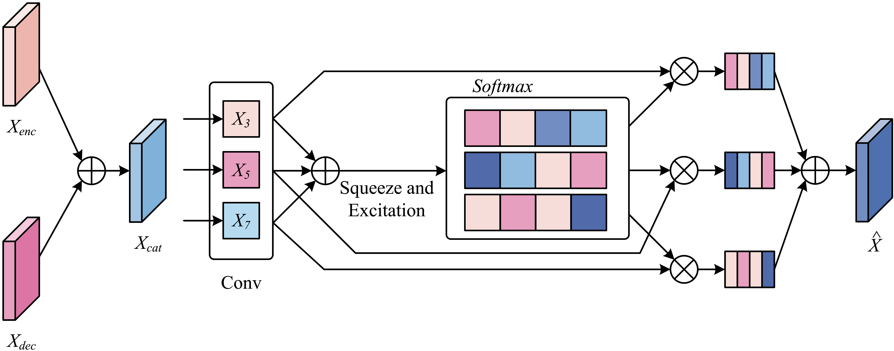


# GAAF-Net
**GAAF-Net: Gated Attention Atrous Spatial Pyramid Pooling and Adaptive Fusion Convolution for Skeletal Fluorosis X-ray Segmentation**

> 本页面为论文的项目主页，包含方法概述、实验结果与数据集获取入口。
> 
> Project page for our paper, including method overview, experiment results and dataset access.

---

## 目录 / Table of Contents
- [摘要 / Abstract](#摘要--abstract)
- [方法概述 / Method Overview](#方法概述--method-overview)
- [可视化对比 / Visual Comparison](#可视化对比--visual-comparison)
- [定量结果 / Quantitative Results](#定量结果--quantitative-results)
- [数据集 / Dataset](#数据集--dataset)
- [论文 / Paper](#论文--paper)
- [致谢 / Acknowledgements](#致谢--acknowledgements)
- [许可证 / License](#许可证--license)

---

## 摘要 / Abstract
**中文**
地氟病骨骼X光影像存在病灶与背景对比度低、边界模糊、病灶尺度差异大等问题，现有分割方法在多尺度融合中缺乏动态特征选择能力，且无法弥合跳跃连接中编码器与解码器特征的语义鸿沟，难以实现精准病灶分割。针对以上难点，本文提出一种新型分割网络GAAF-Net，用于地氟病X光影像病灶自动分割。该网络在瓶颈层设计**门控注意力空洞空间金字塔池化模块（GA-ASPP）**，为每个空洞卷积分支生成独立注意力权重，实现多尺度特征动态筛选；同时在跳跃连接中嵌入**自适应融合卷积模块（AFC）**，通过可学习多尺度卷积核对齐编解码特征分布，有效弥合语义差异。基于316张地氟病X光影像的五折交叉验证实验表明，GAAF-Net的Dice系数达72.42%，95%分位数豪斯多夫距离低至9.79像素，性能优于七种主流先进分割算法，可精准完成低对比度、尺度多变的氟中毒病灶分割任务，适用于大规模临床筛查。

**English**
Automatic segmentation of skeletal fluorosis lesions in X-ray images remains challenging due to low lesion-to-background contrast, indistinct boundaries, and large-scale variations. Existing methods often lack dynamic feature selection during multi-scale fusion and fail to bridge the semantic gap between encoder and decoder features in skip connections. To address these issues, we propose a novel segmentation network named **GAAF-Net** for automatic lesion segmentation of skeletal fluorosis X-ray images. Specifically, a **Gated Attention Atrous Spatial Pyramid Pooling (GA-ASPP)** module is introduced at the bottleneck to dynamically select informative multi-scale features by generating independent attention weights for each atrous convolution branch. Furthermore, an **Adaptive Fusion Convolution (AFC)** module is designed within skip connections, where learnable multi-scale kernels are used to align feature distributions between encoder and decoder. Extensive five-fold cross-validation on 316 skeletal fluorosis X-ray images demonstrates that GAAF-Net achieves a Dice coefficient of **72.42%** and a 95th percentile Hausdorff Distance of **9.79 pixels**, outperforming seven state-of-the-art methods. The proposed method can accurately segment fluorosis lesions with low contrast and variable scales, showing great application potential for large-scale clinical screening.

 
<em>图 1：GAAF-Net 整体架构 / Overall architecture of GAAF-Net</em>

 
<em>图 2：GA-ASPP 模块结构 / Structure of GA-ASPP Module</em>

 
<em>图 3：AFC 模块结构 / Structure of AFC Module</em>

---

## 方法概述 / Method Overview
**中文**
GAAF-Net 基于 U-Net 编解码框架构建，采用深度可分离卷积优化特征提取效率，针对地氟病X光影像分割难点，创新性设计双核心模块，实现多尺度特征自适应提取与跨层特征精准融合：
1. **门控注意力空洞空间金字塔池化（GA-ASPP）**：构建包含1×1卷积、多膨胀率空洞卷积与全局平均池化的六分支并行结构，通过残差注意力门为各分支分配动态权重，自适应强化有效病灶特征、抑制背景冗余信息，解决病灶尺度差异大的分割难题。
2. **自适应融合卷积（AFC）**：在跳跃连接中嵌入3×3、5×5、7×7多尺度卷积分支与轻量化通道注意力机制，动态融合不同尺度编解码特征，校准特征分布、消除语义冲突，有效抑制骨骼纹理干扰，精准保留病灶边界细节。

**English**
Built on the classic U-Net encoder-decoder framework, GAAF-Net adopts depthwise separable convolutions to optimize feature extraction efficiency. To tackle the inherent difficulties of skeletal fluorosis X-ray segmentation, we design two core modules to realize adaptive multi-scale feature extraction and accurate cross-layer feature fusion:
1. **Gated Attention Atrous Spatial Pyramid Pooling (GA-ASPP)**: A six-branch parallel structure consisting of 1×1 convolution, atrous convolutions with multiple dilation rates, and global average pooling. It dynamically assigns adaptive weights to each branch via residual attention gates, enhancing valid lesion features and suppressing background redundancy to handle variable-scale lesions.
2. **Adaptive Fusion Convolution (AFC)**: Embedded in skip connections with 3×3, 5×5, 7×7 multi-scale convolution branches and lightweight channel attention. It dynamically fuses cross-layer encoder-decoder features, calibrates feature distributions, eliminates semantic conflicts, suppresses interference from complex bone textures, and preserves fine lesion boundary details.

---

## 可视化对比 / Visual Comparison

 
<em>与主流分割方法的定性对比 / Qualitative comparison against state-of-the-art segmentation methods</em>

---

## 定量结果 / Quantitative Results
### 主实验对比 / Main Comparison
| 模型 / Model | DSC(%) ↑ | IOU(%) ↑ | Pre(%) ↑ | Rec(%) ↑ | HD₉₅(px) ↓ | Params(M) | FLOPs(G) | Time(ms) |
|:---|:---:|:---:|:---:|:---:|:---:|:---:|:---:|:---:|
| UNet | 51.40±1.12 | 34.76±1.08 | 59.28±0.96 | 47.80±0.79 | 26.84±1.64 | 31.04 | 40.19 | 87.13 |
| UNet3+ | 58.32±0.97 | 41.92±0.98 | 62.31±1.03 | 53.94±0.87 | 21.41±1.36 | --- | --- | --- |
| Deeplab v2 | 61.83±1.26 | 44.78±1.05 | 63.92±1.01 | 61.54±0.91 | 18.24±1.29 | --- | --- | --- |
| Deeplab v3 | 64.91±0.94 | 47.84±1.12 | 66.52±0.96 | 63.33±1.13 | 14.96±1.17 | 58.63 | 42.01 | 92.68 |
| Attention-Unet | 66.87±1.10 | 50.22±1.22 | 65.75±0.99 | 67.46±1.06 | 13.74±1.27 | 34.88 | 34.88 | 82.47 |
| DenseASPP | 67.14±0.72 | 50.48±0.71 | 65.78±0.57 | 66.96±0.86 | 13.43±1.15 | --- | --- | --- |
| DSGA-Net | 71.69±0.44 | 55.87±0.54 | 70.50±0.52 | 71.63±0.67 | 10.88±0.55 | 36.44 | 61.34 | 112.53 |
| **GAAF-Net (Ours)** | **72.42±0.53** | **56.74±0.65** | **71.44±0.35** | **73.39±0.53** | **9.79±0.53** | **84.16** | **117.65** | **198.71** |

### 消融实验 / Ablation Study
| 模型 / Model | DSC(%) ↑ | IoU(%) ↑ | Pre(%) ↑ | Rec(%) ↑ | HD₉₅(px) ↓ |
|:---|:---:|:---:|:---:|:---:|:---:|
| U-Net | 51.12 | 37.10 | 59.42 | 47.13 | 27.12 |
| U-Net + GA-ASPP(bottleneck) | 60.93 | 43.82 | 65.18 | 57.26 | 18.67 |
| U-Net + GA-ASPP (up sample) | 58.19 | 41.04 | 62.71 | 54.34 | 16.98 |
| U-Net + AFC (bottleneck) | 59.73 | 42.59 | 63.07 | 56.73 | 19.24 |
| U-Net + AFC (up sample) | 57.20 | 40.07 | 63.18 | 52.29 | 22.16 |
| U-Net + GA-ASPP (up) + AFC (bottleneck) | 66.27 | 49.58 | 69.49 | 63.36 | 12.32 |
| **U-Net + GA-ASPP (bottleneck) + AFC (up)** | **72.35** | **56.69** | **71.37** | **73.41** | **9.64** |

---

## 数据集 / Dataset
**中文**
本研究构建了专属地氟病骨骼X光分割数据集，包含316张有效X光样本，覆盖胫腓骨、桡尺骨、骨盆三大解剖区域。所有影像均由资深放射科医师手动精细标注，疑难样本由高年资医师终审确认，标注精准可靠。
**部分脱敏数据集下载**：https://pan.baidu.com/s/12nDec4sANK55GI1OYsozqw?pwd=sdqb

### 数据说明与伦理声明 / Dataset Notes & Ethics
1. 所有影像数据均已完成脱敏处理，去除患者可识别信息。
   All imaging data have undergone de-identification to remove patient-identifiable information.
2. 数据集仅用于**学术研究，不得用于临床用途**。
   The dataset is released for **academic research only, not for clinical usage**.
3. 禁止商业使用，禁止尝试重新识别患者个体。
   Commercial use is prohibited. Do not attempt to re-identify individual patients.

**English**
The skeletal fluorosis X-ray dataset contains 316 valid X-ray samples covering three anatomical regions: tibia–fibula, radius–ulna, and pelvis. All images are manually annotated by experienced radiologists, and ambiguous cases are finalized by a senior radiologist.
**Partial de-identified dataset download**: https://pan.baidu.com/s/12nDec4sANK55GI1OYsozqw?pwd=sdqb

---

## 论文 / Paper
**论文题目 / Title**
GAAF-Net: Gated Attention Atrous Spatial Pyramid Pooling and Adaptive Fusion Convolution for Skeletal Fluorosis X-ray Segmentation

**会议 / Conference**
ICASSP 2026

**作者 / Authors**
Maohua Gu, Yun Wu*, Chengdong Ye, Zhihao Li, Minhan Li

---

## 致谢 / Acknowledgements
**中文**
本工作得到国家自然科学基金（62666019）资助。

**English**
This work has been supported by the National Natural Science Foundation of China (62666019).

---

## 许可证 / License
MIT License，详见 [LICENSE](./LICENSE) 文件。
MIT License, see [LICENSE](./LICENSE) file for details.
